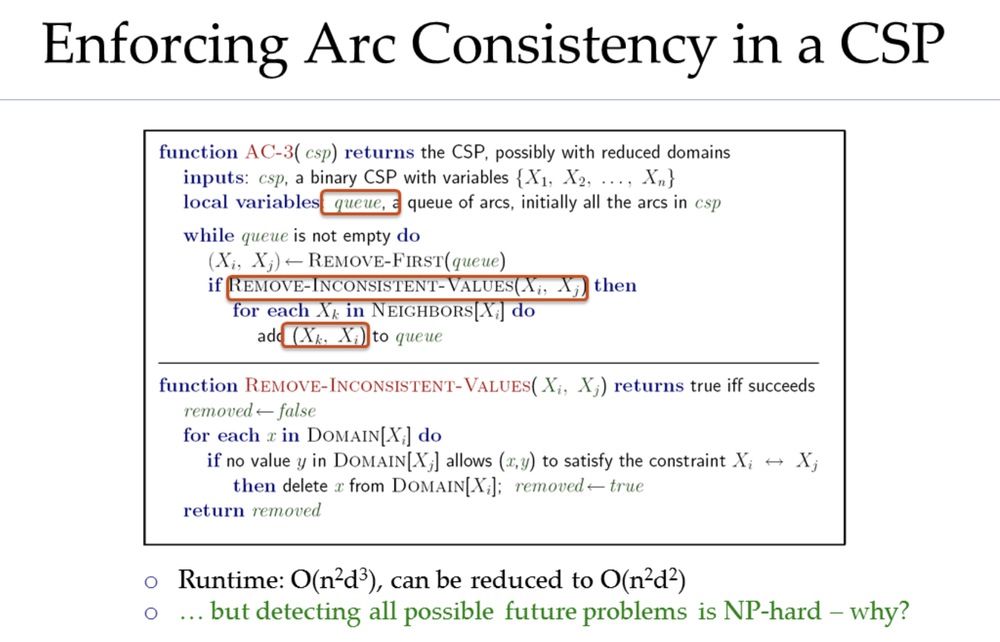
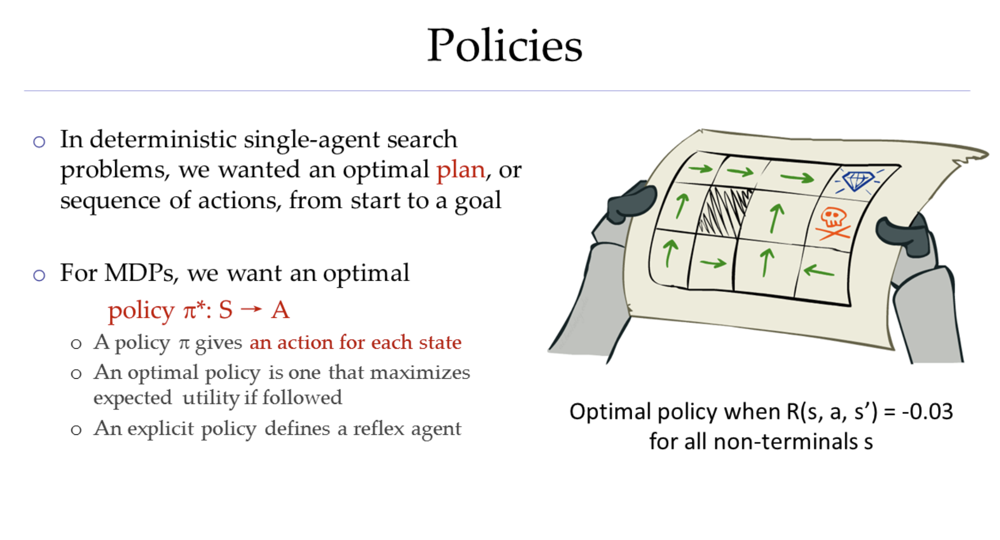
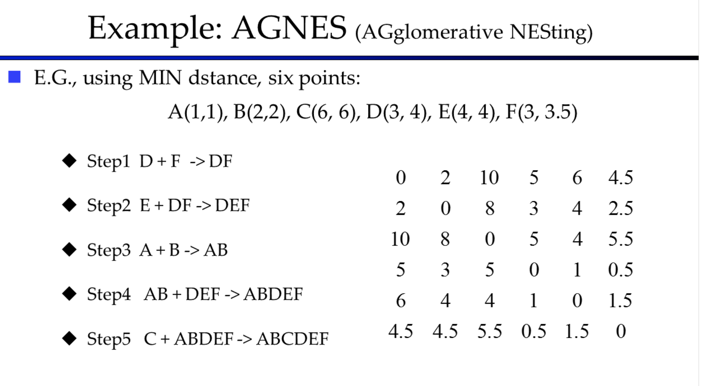

# 1.进化算法概述[1]

在**计算智能 computational intelligence** 领域，演化算法（EA）（或称进化算法）是演化计算的子集，是一种基于群体的元启发式最优化算法。演化算法使用到了各种模拟[生物演化](https://wiki.swarma.org/index.php?title=生物演化&action=edit&redlink=1)机制的操作，比如繁衍、变异、重组、选择等。在群体中每一个个体都是问题的备选解，而**适应度函数 fitness function**用于计算出每一个解的质量（亦即个体对于环境的适应度）。演化就是在不断在群体中进行繁衍、变异、重组、选择这些操作进而找出最优解的过程。

演化算法通常会对各种优化问题得出很好的近似解，因为演化算法不会做出任何假设，对每一个问题都一视同仁。演化算法通常应用于求解最优化问题，在生物建模方面一般来说只会用在基于细胞过程的微观演化过程和规划模型研究中。在大多数演化算法的应用中，计算复杂度都是最大的障碍。事实上，这种计算复杂度来源于[适应度函数](https://wiki.swarma.org/index.php?title=适应度函数&action=edit&redlink=1)。**适应度近似法 fitness approximation**是克服这一障碍的方法之一。但看似简单的演化算法经常能够解决复杂的问题，因此，算法的复杂度应该与问题的复杂度没有直接关系。

## 1.1 实现

第一步：随机生成第一代群体。

第二步：重复下面各步直到满足中止条件：

1. 计算群体中每个个体的适应度
2. 选择适应度最高个体进行繁衍操作。
3. 对于繁衍下来的新个体进行重组和变异操作，以得到后代。
4. 计算新个体的适应度。
5. 淘汰掉群体中适应度低的个体。

# 1.2 类型

演化算法的具体技术可以按照遗传信息表达方式、实现细节、以及特定问题的特定处理分类。

- [==遗传算法==[2]](https://wiki.swarma.org/index.php/遗传算法) Genetic algorithm：这是演化算法中最常用的类型。这种技术应用于求解最优解是一组数字的问题。
- 遗传编程 Genetic programming ：这种技术用于生成一段计算机程序，其适应度就是这些计算机程序解决某计算问题的能力，具体案例可以参考[使用pythony实现遗传算法](https://wiki.swarma.org/index.php/使用pythony实现遗传算法)。
- 演化编程 Evolutionary programming ：与遗传编程类似，但其求解的计算机程序的结构是固定的，可以演化的是一些数值参数。
- 基因表达编程 Gene expression programming ：类似于遗传编程，基因表达规划同样以计算机程序群体来进行演化计算，但这种计算机程序虽然大小不同，却都编码在相同固定的线性染色体中。
- 演化策略 Evolution strategy ：这种技术以实数向量作为个体，而且使用了自适应的变异率。
- ==差分演化== Differential evolution ：这种算法以向量的差为基础，因此特别适合数值最优化问题。
- 神经演化 Neuroevolution：类似于遗传编程，但是基因组表示的是人工神经网络的结构和连接权重，这种基因组编码可以是直接编码也可以是间接编码。
- 学习分类器系统 Learning classifier system ：这种技术的解是一组分类器（规则或条件）。密歇根-学习分类器系统 Michigan-LCS在个体层面进行演化，而匹兹堡-学习分类器系统 Pittsburgh-LCS则使用分类器集合群体来演化。最开始的时候这些分类器都是0-1编码的，如今包含实数、神经网络、或者S-expression。其适应度一般是分类器系统应用于强化学习或有监督学习时的准确率。
- ==协同进化==：是一个求解大规模优化问题的算法，该算法采取“分而治之”的策略。对于一个优化问题，依变量分解成若干组问题，分组优化，且各分组间进行合作协同，共同完成整个问题的优化。[3]

其他相关算法：

- [蚁群优化算法](https://wiki.swarma.org/index.php/蚁群优化算法)：这种技术以蚂蚁觅食和通过信息素沟通寻路为基础，最早应用于组化优化和图相关问题。
- 茎根算法 runner-root algorithm：一种受自然中植物的茎和根的功能启发的算法。
- 人工蜂群算法 Artificial bee colony algorithm：根据蜜蜂觅食行为设计，最初为数值优化提出，后来扩展至解决组合、受约束的多目标最优化问题。
- 布谷鸟搜索 Cuckoo search：根据布谷鸟巢寄生的行为提出，同时使用了 Lévy flights 机制，因此适用于全局最优化问题。
- 电子优化算法：这种技术背后的思想是电子流经电路时根据最小电阻原则分流的原理。

- [==粒子群算法==](https://wiki.swarma.org/index.php?title=粒子群算法&action=edit&redlink=1)：是通过模拟鸟群觅食行为而发展起来的一种基于群体协作的随机搜索算法，最适合用于解决数值优化问题。

- 狩猎搜索 Hunting Search ：根据自然中地狩猎行为提出，一群捕食者，如狼群，组织他们的位置来包围猎物。捕食者中每一个个体的位置会根据其他个体，尤其是领袖的位置调整。这是一个连续型优化方法，后改进为组合优化方法。
- 适应性维度搜索 Adaptive dimensional search ：不同于仿生元启发式技术，适应性维度搜索没有模仿任何大自然中的现象。它使用简单的性能导向方法，每一次迭代过程都会更新搜索维度率 search dimension ratio 。
- 萤火虫算法 Firefly algorithm：通过模仿萤火虫发光互相吸引的行为设计，特别适用于多峰函数的最优化求解。
- 和弦搜索 Harmony search ：基于音乐家探索更好的和弦的因为提出，适用于组合优化和参数优化。
- 高斯适应 Gaussian adaptation ：一种基于信息论的方法， 用于最大化成品率、平均适应度、平均信息量等。参考热力学和信息论中的熵
- 模因算法 Memetic algorithm：这是一种混合方法，根据理查德·道金斯的**模因 meme**概念提出。这通常在基于群体的算法中，给每一个个体加入学习行为使得他们可以进行局部优化。这种方法强调利用每个问题自身的特性，并调和局部和全局搜索。
- 帝企鹅群：一种受帝企鹅群的行为启发的方法。在群体中的帝企鹅会产生适应的热量并调整自身的体温，这种热量只受每只企鹅的移动来调整和控制。

# 2.遗传算法

 遗传算法中如何保持种群多样性？[100]

  （1）监测种群多样性，低于某个阈值时提高交叉、变异率； （2）对近亲（计算海明距离， 低于某个值则认为是近亲）禁止其交叉产生后代

# 3.粒子群优化算法（不用）

# 4.差分进化算法

# 5.CCFR基于贡献度的协同进化

1. 进化不动的停止进化
2. 每轮只进化最有贡献的

# Reference

*此档案非原创，以下为所有出处*

1. [演化算法 Evolutionary Algorithms - 集智百科 - 复杂系统|人工智能|复杂科学|复杂网络|自组织 (swarma.org)](https://wiki.swarma.org/index.php/演化算法_Evolutionary_Algorithms)
2. [遗传算法 - 集智百科 - 复杂系统|人工智能|复杂科学|复杂网络|自组织 (swarma.org)](https://wiki.swarma.org/index.php/遗传算法)
3. [机器学习中四类进化算法的详细讲解！（遗传算法、差分进化算法、协同进化算法、分布估计算法） - 知乎 (zhihu.com)](https://zhuanlan.zhihu.com/p/442270629)

100.[(53条消息) 进化算法简单介绍_Mingsheng Zhang的博客-CSDN博客](https://blog.csdn.net/youhuakongzhi/article/details/122201635)

to read stack：

[【优化算法】遗传算法(Genetic Algorithm) （附代码及注释）-腾讯云开发者社区-腾讯云 (tencent.com)](https://cloud.tencent.com/developer/article/1425840)

[如何通俗易懂地解释遗传算法？有什么例子？ - 知乎 (zhihu.com)](https://www.zhihu.com/question/23293449)

[【算法】超详细的遗传算法(Genetic Algorithm)解析 - 简书 (jianshu.com)](https://www.jianshu.com/p/ae5157c26af9)

[10分钟搞懂遗传算法(含源码) - 知乎 (zhihu.com)](https://zhuanlan.zhihu.com/p/33042667)

[(53条消息) 遗传算法详解（GA）（个人觉得很形象，很适合初学者）_boat_lee的博客-CSDN博客](https://blog.csdn.net/u010451580/article/details/51178225)

[粒子群优化算法(Particle Swarm Optimization, PSO)的详细解读 - 知乎 (zhihu.com)](https://zhuanlan.zhihu.com/p/346355572)

[机器学习中四类进化算法的详细讲解！（遗传算法、差分进化算法、协同进化算法、分布估计算法） - 知乎 (zhihu.com)](https://zhuanlan.zhihu.com/p/442270629)

[(53条消息) 多目标优化中常用的进化算法简介及原论文（最全概括）_r-nsga-iii_小怪兽会微笑的博客-CSDN博客](https://blog.csdn.net/a1920993165/article/details/114738229)

[(53条消息) 人工智能算法（一）进化算法_以下哪种人工智能算法与进化论有关_知性肥宅在线写bug的博客-CSDN博客](https://blog.csdn.net/ACM5100/article/details/86556394)

[遗传算法 - 集智百科 - 复杂系统|人工智能|复杂科学|复杂网络|自组织 (swarma.org)](https://wiki.swarma.org/index.php/遗传算法)

[机器学习中四类进化算法的详细讲解！（遗传算法、差分进化算法、协同进化算法、分布估计算法） - 知乎 (zhihu.com)](https://zhuanlan.zhihu.com/p/442270629)

[遗传算法和超参数优化 - 知乎 (zhihu.com)](https://zhuanlan.zhihu.com/p/123319468)

[(55条消息) 协同优化算法_随遇而安随缘一世的博客-CSDN博客](https://blog.csdn.net/lcj_cjfykx/article/details/7661576)

[协同优化算法 - 维基百科，自由的百科全书 (wikipedia.org)](https://zh.wikipedia.org/wiki/协同优化算法)

# 考点

1. 第一章：

   - 什么是人工智能（描述）

     一些定义。（ppt）关于哪三个方面？

     ​	“首先是关于哪三个方面，然后要建模来描述问题，具体来说这个模型由两部分构成（编码方式和约束），这个模型方便专业人士之间进行沟通交流，最后还需要一个算法来解决问题”

   - 有一页PPT（AI历史）：

     AI 1956年出来的

     专家系统大概哪个时代

   - AI功能边界（跟着上一个的ppt）（能干什么，不能干什么）
   - 什么是人工智能

2. 第二章：三个算法（DFS,BFS,UCS）

   - 搜索问题：

     - 状态
     - 继承函数
     - 开始状态和目标测试

   - 一个解决方案是一个动作的序列

   - 一个搜索问题的例子

     

   - 另一个例子

     

   - 状态空间怎么计算的

     

   - 状态转换图

     

   - 三个基于树的搜索

     - DFS（知道什么是DFS）

       要求给你一颗搜索树，告诉你起始和终点，能把扩展序列写出来

       

       - 性能：

         ​	DFS不是完备的，不是最优的，但是好处是空间复杂度比较低（对比DFS和BFS）

       - 

     - BFS

       - BFS是完备的，不是最优的，劣势是空间消耗大
       - 给你一颗搜索树，能BFS展开

     - UCS

       

       - 扩展的是当前代价最小的路径
       - UCS是完备的，也是最优的

     

3. 第三章（一个概念三个算法）：

   - 启发式算法

   - 贪心算法（快，但容易陷入局部最优）

   - A*（缝合怪：UCS+贪心）（取两者优点：完备和最优，搜索快）

     - 算法流程

       当前路径长度+....作为指标扩展的

     - 入队的时候发现是解不会终止，只有出队的时候会

     - 欧式距离就一定是最乐观的

     - 乐观的启发式怎么设计

   - 图搜索 A*的要求

4. 第四章：约束满足（会建模，说清楚决策向量是什么，域是什么...，通过四个策略改进）

   - 约束满足问题（怎么建模）（域和自变量）

     

   - 建模的例子：

     

   - 另一个例子：

     

   - 重点：对DFS的改进（回溯）

     

   - 滤波（理解弧一致性原则）

     

   - 排序：（先处理哪个变量，给这个变量赋什么值）

     

     - 取值要对后续变量影响最小

   - （树）为什么能降低算法复杂度：

     - 反向一致性的检查
     - 前向赋值

5. 第五章：对抗搜索

   - 典型问题（下棋）

   - 

   - 告诉我一个策略：局势是这样，告诉我接下来的动作

     

   - （重点）：minimax（博弈路线怎么看，怎么得到的）

     

   - 

   - 效果：跟DFS一直（时间和空间复杂度）

     

   - 剪枝

   - Expectimax (给你这棵树，把每个节点效用值算出来)

     

   - 马尔可夫决策过程

     

   - 策略

     

     

   - 价值衰减的概念（给你一个γ怎么打折）

   - 例子：

     

     - 要会标注节点(s,a)(s,a,s')

       

       

       

     - 要求：计算上面的某一代value

   - 策略抽取：（怎么抽取一个策略，给你一个状态，把它的动作求出来，就是将这个状态后面最大的Q的动作取出来）

   - 策略迭代：（理解公式）

     

     

   - 

6. 第七章（强化学习，不清楚转移的概率，不去执行也不知道回报）

   - 基于模型

   - 非基于模型

     - 直接评估

     - 时序差分（理解什么是学习，掌握计算过程，知道怎么算的）

       

     - Q-learning（知道为什么要有这个，时序差分的缺点（得到的结果不明显），Q-laerning直观，直接算Q的效用值，掌握计算的公式（跟时序差分公式一模一样））

   - 什么叫搜索，什么叫开发（能描述这两个概念）

     （快速的定位 - 精细化的开发）	

7. 第八章：演化算法（给你一个问题，如果适合用某一个算法求解，你要识别出来，要把编码方式和适应性函数说清楚）

   - 遗传算法

     - 算法流程

       

       - 初始化种群
       - 评估种群
       - 选择（锦标赛，轮盘赌）
       - 交叉变异（均匀交叉，要求给你一个掩码，你能够得到交叉后的染色体；变异：告诉我哪些需要变异）
       - 重新选择

       

   - 粒子群：

     - 算法流程

       

     - 掌握公式

   - 蚁群算法（要求掌握下一个要访问的城市概率是多少算出来（公式会给，算出来就算对））

     - 算法流程

       

     - 

     - 

       

8. 第九章不用复习

9. 第十章（几类聚类算法）：

   - K-MEANS

     - 算法流程

       

     - 要求：如果给你某一代选定哪几个点作为小队长，剩下的点分配给哪个小队长

   - AGNES

     - 

   - 重点（基于密度的聚类，就掌握两个参数的意义，并且给你两个参数找出核心点，不用掌握算法流程）

     - 

   - 纯度（怎么算，给你表，算出来C1,C2,C3纯度）

     - 

   - 召回率

     - 

   - 计算F参数（给你表格分别算纯度，召回率和F参数）

